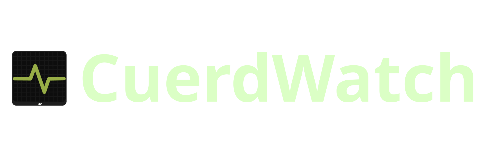
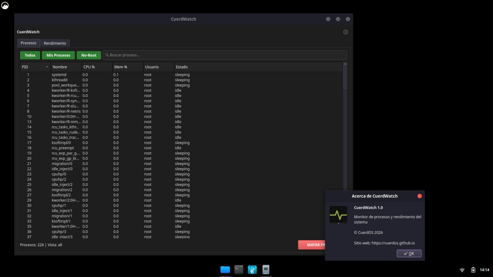

# CuerdWatch for CuerdOS

<p align="center">
  
</p>



## What is **CuerdWatch**?

**CuerdWatch** is a high-performance telemetry and task management application, built on PySide6 (Qt6). Its purpose is to allow CuerdOS users to monitor, filter and manage every aspect of their hardware and software in real time.

## Characteristics
- **User-friendly graphical interface**
- **Fast and lightweight**
- **Shows Graphics in real time**
- **Based on PySide6 for broad compatibility**

## Requirements
- Python3.x
- PySide6
- Qt6

## Instalation
Clone the repository and run the app:

```bash
git clone https://github.com/Just-Alex22/CuerdWatch.git
cd CuerdWatch
python3 main.py

```
## Contributing
If you want to contribute with the development of **CuerdWatch**, follow us on github send your **Pull Requests** and **Issues** through the repository

## Licence
This program comes with the GNU GPLv3 licence, consult https://www.gnu.org/licenses/lgpl-3.0.html for more information.

---

> **Maintainer** [Just_Alex](https://github.com/Just-Alex22)
> **Repository:** [ConkyMan](https://github.com/Just-Alex22/CuerdWatch)

*This README is purely provisional and not fully finished; any errors will be eventually corrected*
